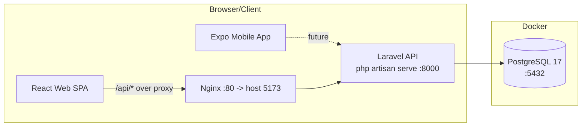

# JALIKUD

A full-stack, mobile-first financial platform built to **sustain economical and financial growth** by helping people and businesses structure, track, and grow their money. JALIKUD is a monorepo containing a Laravel REST API, a React web client, an Expo (React Native) mobile app, and a shared Postman collection for testing the API.

> **Status:** Early-stage scaffolding. Core authentication (register / login / profile / password) and basic **admin user management** are implemented end-to-end. The dashboard is currently a placeholder and the mobile app is a fresh Expo starter.

---

## Table of Contents

- [Tech Stack](#tech-stack)
- [Repository Layout](#repository-layout)
- [Architecture](#architecture)
- [Prerequisites](#prerequisites)
- [Running Locally](#running-locally)
  - [Option A — Docker Compose (recommended)](#option-a--docker-compose-recommended)
  - [Option B — Run outside Docker](#option-b--run-outside-docker)
- [Database Access](#database-access)
- [API Reference](#api-reference)
- [Authentication & Roles](#authentication--roles)
- [Testing with Postman](#testing-with-postman)
- [CI/CD & Deployment](#cicd--deployment)
- [Environment Variables](#environment-variables)
- [Useful Commands](#useful-commands)
- [Troubleshooting](#troubleshooting)

---

## Tech Stack

| Layer     | Technology                                                                                             |
| --------- | ------------------------------------------------------------------------------------------------------ |
| Backend   | **Laravel 13** (PHP 8.4), **Laravel Sanctum 4** for token auth, rate-limited auth                |
| Database  | **PostgreSQL 17** (with SQLite support for quick local dev)                                            |
| Frontend  | **React 19**, **Vite 8**, **TypeScript**, **Tailwind CSS v4**, **React Router 7**, **Axios**           |
| Mobile    | **Expo 57** / **React Native 0.86** with **expo-router** (file-based routing)                           |
| Web serve | **Nginx** (serves the built frontend and proxies `/api` to the backend)                                 |
| Containers| **Docker / Docker Compose**                                                                            |
| Registry  | **GitHub Container Registry (GHCR)**                                                                    |
| CI/CD     | **GitHub Actions** (build & push images, optional self-hosted local deploy)                             |
| API tools | **Postman** (shared collection + environment)                                                           |

### Key versions

- PHP `8.4` (composer requires `^8.3`)
- Laravel framework `^13.17`
- Laravel Sanctum `^4.0`
- Node `22` (build image)
- React `19`
- PostgreSQL `17-alpine`

---

## Repository Layout

```text
JALIKUD/
+-- backend/            # Laravel REST API (separate Docker build)
¦   +-- app/            #   controllers, middleware, models
¦   +-- config/         #   Sanctum expiry, etc.
¦   +-- database/       #   migrations, factories, seeders
¦   +-- routes/api.php  #   all API routes live here
¦   +-- Dockerfile
¦   +-- docker-entrypoint.sh   # prepares .env, migrates, serves
+-- frontend/           # React + Vite + TS web SPA (separate Docker build)
¦   +-- src/            #   pages, components, context, services
¦   +-- Dockerfile      #   multi-stage: build -> nginx
¦   +-- nginx.conf      #   SPA fallback + /api proxy to backend
+-- mobile/Jalikud/     # Expo / React Native app (not yet containerized)
+-- postman/            # API collection + "JALIKUD Local" environment
+-- .github/workflows/  # deploy.yml (build & push to GHCR, optional deploy)
+-- deploy.ps1          # pull GHCR images + restart local stack
+-- docker-compose.yml  # postgres + backend + frontend
+-- .env.example        # template for the root .env
+-- README.md
```

---

## Architecture

The system is a classic **client ? API ? database** split. The web SPA and the mobile app both talk to the same Laravel JSON API (though the mobile app is only scaffolded at this stage). In Docker, the frontend is served by **Nginx**, which also reverses proxies all `/api/*` traffic to the Laravel container so the browser only ever talks to one origin.



### Request flow (web)

1. The browser loads the **React SPA** from Nginx on `http://localhost:5173`.
2. The SPA (via Axios) issues requests under the `/api` base path — e.g. `POST /api/login`.
3. Nginx forwards (`proxy_pass`) `/api` to the `backend` container on port `8000`.
4. **Laravel** runs the request through middleware: rate limiting (`throttle`), optional Sanctum token guard, and the admin-only `EnsureAdmin` middleware for `/api/admin/*`.
5. Laravel reads/writes **PostgreSQL**, then returns JSON. Nginx relays the JSON back to the browser.

> When you run the frontend **without Docker** (`npm run dev`), Vite's dev server proxies `/api` ? `http://localhost:8000` (see `frontend/vite.config.ts`) — same flow, still one origin.

### Security features built in

- **Sanctum tokens** — `POST /login` / `POST /register` return a `plainTextToken`. Send it as `Authorization: Bearer <token>`.
- **Token expiry** — Sanctum tokens expire after **7 days** by default (`SANCTUM_TOKEN_EXPIRATION`, see `config/sanctum.php`).
- **Rate limiting** — `/login` and `/register` are capped at **5 requests per minute** (`throttle:5,1`) to slow brute-force attempts.
- **Role guard** — `/api/admin/*` returns `403` unless the authenticated user has `role = admin`.
- **Self-protection** — an admin cannot demote or delete their own account.

---

## Prerequisites

| Tool              | Why                                              | Version                        |
| ----------------- | ------------------------------------------------ | ------------------------------ |
| **Docker**        | Run the whole stack with Compose                 | Docker **24+** / Compose v2 |
| **Git**           | Clone the repository                            | any recent                     |
| PHP `8.4+`        | Optional — local backend dev / laravel commands | ^8.3                           |
| Composer `2`      | Optional — backend dependencies                 | 2.x                            |
| Node.js `22+`     | Optional — frontend / mobile local dev          | 22+/20+                        |

You can run everything with **Docker alone** — PHP, Composer, and Node are only needed for the "run outside Docker" workflow or for artisan commands.

---

## Running Locally

### Option A — Docker Compose (recommended)

This spins up **three** services defined in `docker-compose.yml`:

| Service   | Container name      | Exposed port | Purpose                          |
| --------- | ------------------- | ------------ | -------------------------------- |
| `postgres` | `jalikud-postgres` | `5432`       | Application database (volume `pgdata`) |
| `backend` | `jalikud-api`     | `8000`       | Laravel API (auto-migrates on boot)   |
| `frontend`| `jalikud-web`      | `5173`       | Nginx serving the React SPA       |

#### 1. Configure the environment

The compose file is driven by a **root `.env`** (not the one inside `backend/`). Copy the template and fill it in:

```bash
# from the repository root
cp .env.example .env
```

The two required variables are `POSTGRES_PASSWORD` and `APP_KEY`. Set them for real:

```bash
# .env
POSTGRES_DB=jalikud
POSTGRES_USER=jalikud
POSTGRES_PASSWORD=supersecret
APP_KEY=base64:PASTE-A-GENERATED-KEY-HERE
```

Generate a valid `APP_KEY` (must start with `base64:`):

```bash
# on a machine with PHP
php -r "echo 'base64:'.base64_encode(random_bytes(32));"
```

> If `POSTGRES_PASSWORD` or `APP_KEY` is missing, `docker compose up` will abort with `Set ... in the root .env`.

#### 2. Build & start

```bash
docker compose up --build -d
```

- `--build` compiles the images from the local `backend/` and `frontend/` Dockerfiles (not needed if you only pull pre-built images).
- `-d` runs containers detached.

#### 3. Verify

```bash
docker compose ps
```

You should see all three containers `Running` and `healthy`.

#### 4. Open the app

- **Web app:** <http://localhost:5173>
- **API directly:** <http://localhost:8000/api/...> (e.g. `http://localhost:8000/api` health/up at `http://localhost:8000/up`)
- **Postgres:** `localhost:5432` with the credentials from `.env`

On first boot the backend container runs migrations automatically (see `docker-entrypoint.sh`), so the schema is ready — you can register a user right away.

#### Stop / reset

```bash
docker compose down          # stop (keep the database volume)
docker compose down -v       # stop AND delete the database volume (fresh start)
```

---

### Option B — Run outside Docker

Run each service directly on your machine. You still need the `backend/.env` (the Laravel one), with a database connection pointing at a running PostgreSQL (or switch to SQLite for a lightweight setup).

#### 0. Database

Either run PostgreSQL yourself, or use only the Postgres container:

```bash
docker compose up -d postgres
```

#### 1. Backend (Laravel API)

```bash
cd backend
cp .env.example .env        # set DB_*, APP_KEY, generate key
composer install
php artisan key:generate
php artisan migrate --seed  # optional --seed creates a test@example.com user
php artisan serve            # --- http://localhost:8000
```

For the web UI to proxy correctly in dev, make sure `backend/.env` has:
`(DB_* must point at your DB)`. Generate the key if `APP_KEY` is empty (`php artisan key:generate`).

#### 2. Frontend (React SPA)

```bash
cd frontend
npm install
npm run dev                  # --- http://localhost:5173, proxies /api -> :8000
```

#### 3. Mobile (Expo)

```bash
cd mobile
npm install
npx expo start               # scan the QR with Expo Go, or press a / i
```

---

## Database Access

PostgreSQL runs on `localhost:5432` with:

- **Database:** `POSTGRES_DB` (default `jalikud`)
- **User:** `POSTGRES_USER` (default `jalikud`)
- **Password:** `POSTGRES_PASSWORD` (from your root `.env`)

Connect with any client:

```bash
docker exec -it jalikud-postgres psql -U jalikud -d jalikud
# or with a GUI using host=localhost port=5432 and the values above
```

The database schema is managed by **Laravel migrations**:

| Migration | What it creates |
| --------- | --------------- |
| `create_users_table` | users (name, email, password, remember token) |
| `create_cache_table`  | cache store (Laravel cache is DB-backed) |
| `create_jobs_table`   | queue jobs/failed jobs |
| `create_personal_access_tokens_table` | Sanctum token storage |
| `add_role_to_users_table` | adds `enum('user','admin')` role to users |

---

## API Reference

All endpoints live under the `/api` prefix (an API prefix middleware is applied automatically by Laravel, and Nginx/Vite proxy this path to the backend). The backend responds with JSON (configured via `shouldRenderJsonWhen(...)` in `bootstrap/app.php`).

### Public endpoints

| Method | Path          | Description                                 | Rate limit |
| ------ | ------------- | ------------------------------------------- | ---------- |
| `POST` | `/api/register` | Create an account, returns user + token   | 5/min |
| `POST` | `/api/login`    | Authenticate, returns user + token        | 5/min |

**Register request body:**
```json
{ "name": "Jane Doe", "email": "jane@example.com", "password": "password123", "password_confirmation": "password123" }
```

**Login request body:**
```json
{ "email": "jane@example.com", "password": "password123" }
```

Both return:
```json
{ "message": "...", "user": { "id": 1, "name": "...", "email": "...", "role": "user", ... }, "token": "1|xxxxxxxxxx" }
```

> ?? Auth is limited to **5 requests per minute per IP**. If you hit `429 Too Many Requests`, wait a minute.

### Protected endpoints (require `Authorization: Bearer <token>`)

| Method   | Path                | Description                                                       |
| -------- | ------------------- | ----------------------------------------------------------------- |
| `GET`    | `/api/user`         | Return the authenticated user                                    |
| `PUT`    | `/api/profile`      | Update own name / email                                           |
| `PUT`    | `/api/password`     | Change own password (needs `current_password`)                    |
| `POST`   | `/api/logout`       | Revoke the current token                                          |

**Update profile body:** `{ "name": "...", "email": "..." }`
**Change password body:** `{ "current_password": "...", "password": "...", "password_confirmation": "..." }`

### Admin endpoints (require a user with `role = admin`)

| Method  | Path                 | Description                              |
| ------- | -------------------- | ---------------------------------------- |
| `GET`    | `/api/admin/users`   | Paginated list; `?page=` `&per_page=` (max 100) `&search=` |
| `POST`   | `/api/admin/users`   | Create a user with an explicit `role`     |
| `GET`    | `/api/admin/users/{id}` | Show one user                         |
| `PUT/PATCH` | `/api/admin/users/{id}` | Update name/email/password/role     |
| `DELETE` | `/api/admin/users/{id}` | Delete a user                        |

**Create user body:** `{ "name": "...", "email": "...", "password": "password123", "role": "user" }` (role: `user` or `admin`)

Non-admins calling `/api/admin/*` receive:

```json
{ "message": "Forbidden. Administrator access required." }
```

> A list of users returns `data` (array) plus `meta` (current_page, last_page, per_page, total).

---

## Authentication & Roles

- New users are created with `role = 'user'` by default (the `role` column is an enum `user`/`admin`).
- Tokens are issued via **Laravel Sanctum** and expired after **7 days** by default.
- `/api/admin/*` is protected by the `EnsureAdmin` middleware (`app/Http/Middleware/EnsureAdmin.php`).

### Making yourself an admin (to test the admin API)

Registration always yields a `user` role, so to exercise the admin endpoints you need an admin account. With an already-running stack:

```bash
# A) via psql
docker exec -it jalikud-postgres psql -U jalikud -d jalikud \
  -c "UPDATE users SET role='admin' WHERE email='your@email.com';"

# or B) via artisan tinker (run from backend/ locally, or docker exec into jalikud-api)
cd backend && php artisan tinker
> App\Models\User::where('email','your@email.com')->update(['role'=>'admin']);
```

After that, the user can log in and call `/api/admin/*`.

---

## Testing with Postman

The repo ships a ready-to-use Postman collection and environment in the `postman/` folder:

- `postman/JALIKUD_API.postman_collection.json`
- `postman/JALIKUD_Local.postman_environment.json`

### 1. Import

Open **Postman ? Import ? Files**, select both files (or drag them in), and import.

### 2. Select the environment

In the top-right environment dropdown choose **`JALIKUD Local`**. This environment pre-fills `base_url`:

```text
http://localhost:5173/api
```

| Variable        | Value                    | Purpose                              |
| --------------- | ------------------------ | ------------------------------------ |
| `base_url`      | `http://localhost:5173/api` | Base for every request             |
| `token`         | *(auto-filled)*          | Bearer token, set by Login/Register  |
| `user_id`       | `1`                      | Used in admin `{id}` routes          |
| `page`          | `1`                      | Admin pagination param               |
| `admin_search`  | *(blank)*                | Admin `search` query param           |

### 3. Run the flow

1. **Make sure the stack is running** (`docker compose up --build -d` ? app on `http://localhost:5173`).
2. Run **Auth ? Register** (or **Auth ? Login**) once. The collection's test script automatically saves the returned token into the `token` environment variable, so the token stays filled for all the protected/Admin requests.
3. Navigate the folders: **Auth ? My Account** for your own profile, and **Admin ? ...** for user management (requires an admin account — see above).

> The default Login body uses `sec@example.com`. Either update it to the account you created, or use **Register** first and let the script store that token.

### Troubleshooting in Postman

- **`401`, empty token** — run Login/Register first; check the `token` variable is filled.
- **`403`** on Admin routes ? the logged-in user is not `role = admin`.
- **`429`** ? hit the 5/minute auth rate limit; wait and retry.
- **Connection errors** ? confirm the Docker stack is up, and that `base_url` is `http://localhost:5173/api`.

---

## CI/CD & Deployment

Deployment is container-based and driven by `.github/workflows/deploy.yml`. It is **manual** (`workflow_dispatch`) so you control when releases happen.

### What the workflow does

1. Checks out the repo and logs into **GHCR** (`ghcr.io`).
2. Builds and pushes both images with `latest` + `${{ github.sha }}` tags:
   - `ghcr.io/jiwonieee19/jalikud-api`
   - `ghcr.io/jiwonieee19/jalikud-web`
3. If a **self-hosted runner** (`runs-on: [self-hosted]`) is registered in repo **Settings ? Actions ? Runners** with Docker installed, it pulls the images and restarts the local Compose stack automatically.

### Updating a local machine from pre-built images

For the "deploy onto the host machine" flow, `deploy.ps1` logs into GHCR, pulls the `latest` backend/frontend images, and restarts the containers:

```powershell
# from the repo root
.\deploy.ps1 -Token <github_pat_with_read:packages>
# or run it with no args to be prompted securely for the token
```

> Create a classic **Personal Access Token** on GitHub at **Settings ? Developer settings ? Personal access tokens** with the `read:packages` scope.

---

## Environment Variables

### Root `.env` (used by Docker Compose)

| Variable          | Required | Default   | Notes                                              |
| ----------------- | -------- | --------- | -------------------------------------------------- |
| `POSTGRES_DB`     | no       | `jalikud` | Database name                                      |
| `POSTGRES_USER`   | no       | `jalikud` | Database user                                      |
| `POSTGRES_PASSWORD` | **yes** | —         | Database password (**Compose aborts if empty**)     |
| `APP_KEY`         | **yes**  | —         | Laravel app key, must be `base64:`-prefixed (**Compose aborts if empty**) |
| `GHCR_TOKEN`      | no       | —         | Used by the deploy workflow for `docker login`      |

### Laravel `backend/.env` (used for non-Docker runs)

Standard Laravel variables, notably:

| Variable | Default | Notes |
| -------- | ------- | ----- |
| `DB_CONNECTION` | `pgsql` | `sqlite` also works for quick local dev |
| `DB_HOST` / `DB_PORT` | `127.0.0.1` / `5432` | `postgres` when running inside Compose |
| `DB_DATABASE` / `DB_USERNAME` / `DB_PASSWORD` | `jalikud` / `jalikud` / `secret` | match your DB |
| `SANCTUM_TOKEN_EXPIRATION` | `10080` (7 days) | token lifetime in minutes; `null` = no expiry |
| `APP_KEY` | — | generate with `php artisan key:generate` |

> `.env` files are git-ignored — never commit real secrets.

---

## Useful Commands

| Task | Command |
| ---- | ------- |
| Start full stack (build) | `docker compose up --build -d` |
| View logs (follow) | `docker compose logs -f` |
| Logs for one service | `docker compose logs backend` (or `frontend`, `postgres`) |
| Stop stack (keep data) | `docker compose down` |
| Reset everything | `docker compose down -v` |
| Backend tests | `cd backend && composer test` |
| Backend formatter | `cd backend && vendor/bin/pint` |
| Frontend lint | `cd frontend && npm run lint` |
| Frontend typecheck+build | `cd frontend && npm run build` |
| List migrations status | `cd backend && php artisan migrate:status` |
| Create a migration | `cd backend && php artisan make:migration create_x_table` |
| Interactive tinker | `cd backend && php artisan tinker` |

---

## Troubleshooting

| Problem | Fix |
| ------- | --- |
| `Compose up` fails with "Set POSTGRES_PASSWORD ..." | Fill `POSTGRES_PASSWORD` in root `.env` |
| `Compose up` fails with "Set APP_KEY ..." | Set a `base64:`-prefixed `APP_KEY` in root `.env` (see [Running Locally](#option-a--docker-compose-recommended)) |
| Backend logs show DB "Connection refused" | The API starts before Postgres is ready even with `depends_on`; check `docker compose logs backend` and restart once Postgres is healthy |
| Frontend loads, API returns 502 | Backend not reachable; `docker compose logs backend` |
| `429 Too Many Requests` on auth | Rate limiter (5/min). Wait a moment and retry |
| `403` on `/api/admin/*` | Account role is not `admin` — promote via psql/tinker (see [Authentication & Roles](#authentication--roles)) |
| Port `8000`/`5173`/`5432` in use | Change the `ports:` mapping in `docker-compose.yml`, then re-run `docker compose up -d` |

---

## Roadmap / What's Next

- [ ] Real financial domain models (accounts, transactions, budgets, reporting)
- [ ] Populate the dashboard with real data and charts
- [ ] Wire the Expo mobile app to the API (register/login + dashboard)
- [ ] Add feature tests (Pest/PHPUnit) for auth + admin, e.g. 403 checks
- [ ] Add automated tests to CI before pushing images

---

## License

See the `mobile/License` file for the app license (and the Laravel/Expo MIT license agreements for their components).
