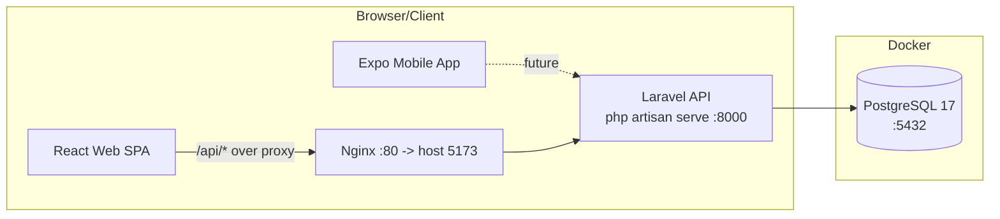

# JALIKUD

A full-stack, mobile-first financial platform built to **sustain economical and financial growth** by helping people and businesses structure, track, and grow their money. JALIKUD is a monorepo containing a Laravel REST API, a React web client, an Expo (React Native) mobile app, and a shared Postman collection for testing the API.

> **Status:** Early-stage scaffolding. Core authentication (register / login / profile / password) and basic **admin user management** are implemented end-to-end. The dashboard is currently a placeholder and the mobile app is a fresh Expo starter.

---

## Table of Contents

- [Tech Stack](#tech-stack)
- [Repository Layout](#repository-layout)
- [Architecture](#architecture)
- [Prerequisites](#prerequisites)
- [Running Locally](#running-locally)
  - [Option A � Docker Compose (recommended)](#option-a--docker-compose-recommended)
  - [Option B � Run outside Docker](#option-b--run-outside-docker)
- [Database Access](#database-access)
- [API Reference](#api-reference)
- [Authentication & Roles](#authentication--roles)
- [Testing with Postman](#testing-with-postman)
- [CI/CD & Deployment](#cicd--deployment)
- [Environment Variables](#environment-variables)
- [Useful Commands](#useful-commands)
- [Troubleshooting](#troubleshooting)

---

## Tech Stack

| Layer     | Technology                                                                                             |
| --------- | ------------------------------------------------------------------------------------------------------ |
| Backend   | **Laravel 13** (PHP 8.4), **Laravel Sanctum 4** for token auth, rate-limited auth                |
| Database  | **PostgreSQL 17** (with SQLite support for quick local dev)                                            |
| Frontend  | **React 19**, **Vite 8**, **TypeScript**, **Tailwind CSS v4**, **React Router 7**, **Axios**           |
| Mobile    | **Expo 57** / **React Native 0.86** with **expo-router** (file-based routing)                           |
| Web serve | **Nginx** (serves the built frontend and proxies `/api` to the backend)                                 |
| Containers| **Docker / Docker Compose**                                                                            |
| Registry  | **GitHub Container Registry (GHCR)**                                                                    |
| CI/CD     | **GitHub Actions** (build & push images, optional self-hosted local deploy)                             |
| API tools | **Postman** (shared collection + environment)                                                           |

### Key versions

- PHP `8.4` (composer requires `^8.3`)
- Laravel framework `^13.17`
- Laravel Sanctum `^4.0`
- Node `22` (build image)
- React `19`
- PostgreSQL `17-alpine`

---

## Repository Layout

```text
JALIKUD/
+-- backend/            # Laravel REST API (separate Docker build)
�   +-- app/            #   controllers, middleware, models
�   +-- config/         #   Sanctum expiry, etc.
�   +-- database/       #   migrations, factories, seeders
�   +-- routes/api.php  #   all API routes live here
�   +-- Dockerfile
�   +-- docker-entrypoint.sh   # prepares .env, migrates, serves
+-- frontend/           # React + Vite + TS web SPA (separate Docker build)
�   +-- src/            #   pages, components, context, services
�   +-- Dockerfile      #   multi-stage: build -> nginx
�   +-- nginx.conf      #   SPA fallback + /api proxy to backend
+-- mobile/Jalikud/     # Expo / React Native app (not yet containerized)
+-- postman/            # API collection + "JALIKUD Local" environment
+-- .github/workflows/  # deploy.yml (build & push to GHCR, optional deploy)
+-- deploy.ps1          # pull GHCR images + restart local stack
+-- docker-compose.yml  # postgres + backend + frontend
+-- .env.example        # template for the root .env
+-- README.md
```

---

## Architecture

The system is a classic **client ? API ? database** split. The web SPA and the mobile app both talk to the same Laravel JSON API (though the mobile app is only scaffolded at this stage). In Docker, the frontend is served by **Nginx**, which also reverses proxies all `/api/*` traffic to the Laravel container so the browser only ever talks to one origin.


```mermaid
graph LR
    subgraph Browser/Client
        FE[React Web SPA] -->|/api/* over proxy| NG
        M[Expo Mobile App] -.->|future| API
    end

    subgraph Docker
        NG[Nginx :80 -> host 5173] --> API
        API[Laravel API<br/>php artisan serve :8000] --> DB[(PostgreSQL 17<br/>:5432)]
    end
```

### Request flow (web)

1. The browser loads the **React SPA** from Nginx on `http://localhost:5173`.
2. The SPA (via Axios) issues requests under the `/api` base path � e.g. `POST /api/login`.
3. Nginx forwards (`proxy_pass`) `/api` to the `backend` container on port `8000`.
4. **Laravel** runs the request through middleware: rate limiting (`throttle`), optional Sanctum token guard, and the admin-only `EnsureAdmin` middleware for `/api/admin/*`.
5. Laravel reads/writes **PostgreSQL**, then returns JSON. Nginx relays the JSON back to the browser.

> When you run the frontend **without Docker** (`npm run dev`), Vite's dev server proxies `/api` ? `http://localhost:8000` (see `frontend/vite.config.ts`) � same flow, still one origin.

### Security features built in

- **Sanctum tokens** � `POST /login` / `POST /register` return a `plainTextToken`. Send it as `Authorization: Bearer <token>`.
- **Token expiry** � Sanctum tokens expire after **7 days** by default (`SANCTUM_TOKEN_EXPIRATION`, see `config/sanctum.php`).
- **Rate limiting** � `/login` and `/register` are capped at **5 requests per minute** (`throttle:5,1`) to slow brute-force attempts.
- **Role guard** � `/api/admin/*` returns `403` unless the authenticated user has `role = admin`.
- **Self-protection** � an admin cannot demote or delete their own account.

---

## Prerequisites

| Tool              | Why                                              | Version                        |
| ----------------- | ------------------------------------------------ | ------------------------------ |
| **Docker**        | Run the whole stack with Compose                 | Docker **24+** / Compose v2 |
| **Git**           | Clone the repository                            | any recent                     |
| PHP `8.4+`        | Optional � local backend dev / laravel commands | ^8.3                           |
| Composer `2`      | Optional � backend dependencies                 | 2.x                            |
| Node.js `22+`     | Optional � frontend / mobile local dev          | 22+/20+                        |

You can run everything with **Docker alone** � PHP, Composer, and Node are only needed for the "run outside Docker" workflow or for artisan commands.

---

## Running Locally

### Option A � Docker Compose (recommended)

This spins up **three** services defined in `docker-compose.yml`:

| Service   | Container name      | Exposed port | Purpose                          |
| --------- | ------------------- | ------------ | -------------------------------- |
| `postgres` | `jalikud-postgres` | `5432`       | Application database (volume `pgdata`) |
| `backend` | `jalikud-api`     | `8000`       | Laravel API (auto-migrates on boot)   |
| `frontend`| `jalikud-web`      | `5173`       | Nginx serving the React SPA       |

#### 1. Configure the environment

The compose file is driven by a **root `.env`** (not the one inside `backend/`). Copy the template and fill it in:

```bash
# from the repository root
cp .env.example .env
```

The two required variables are `POSTGRES_PASSWORD` and `APP_KEY`. Set them for real:

```bash
# .env
POSTGRES_DB=jalikud
POSTGRES_USER=jalikud
POSTGRES_PASSWORD=supersecret
APP_KEY=base64:PASTE-A-GENERATED-KEY-HERE
```

Generate a valid `APP_KEY` (must start with `base64:`):

```bash
# on a machine with PHP
php -r "echo 'base64:'.base64_encode(random_bytes(32));"
```

> If `POSTGRES_PASSWORD` or `APP_KEY` is missing, `docker compose up` will abort with `Set ... in the root .env`.

#### 2. Build & start

```bash
docker compose up --build -d
```

- `--build` compiles the images from the local `backend/` and `frontend/` Dockerfiles (not needed if you only pull pre-built images).
- `-d` runs containers detached.

#### 3. Verify

```bash
docker compose ps
```

You should see all three containers `Running` and `healthy`.

#### 4. Open the app

- **Web app:** <http://localhost:5173>
- **API directly:** <http://localhost:8000/api/...> (e.g. `http://localhost:8000/api` health/up at `http://localhost:8000/up`)
- **Postgres:** `localhost:5432` with the credentials from `.env`

On first boot the backend container runs migrations automatically (see `docker-entrypoint.sh`), so the schema is ready � you can register a user right away.

#### Stop / reset

```bash
docker compose down          # stop (keep the database volume)
docker compose down -v       # stop AND delete the database volume (fresh start)
```

---

### Option B � Run outside Docker

Run each service directly on your machine. You still need the `backend/.env` (the Laravel one), with a database connection pointing at a running PostgreSQL (or switch to SQLite for a lightweight setup).

#### 0. Database

Either run PostgreSQL yourself, or use only the Postgres container:

```bash
docker compose up -d postgres
```

#### 1. Backend (Laravel API)

```bash
cd backend
cp .env.example .env        # set DB_*, APP_KEY, generate key
composer install
php artisan key:generate
php artisan migrate --seed  # optional --seed creates a test@example.com user
php artisan serve            # --- http://localhost:8000
```

For the web UI to proxy correctly in dev, make sure `backend/.env` has:
`(DB_* must point at your DB)`. Generate the key if `APP_KEY` is empty (`php artisan key:generate`).

#### 2. Frontend (React SPA)

```bash
cd frontend
npm install
npm run dev                  # --- http://localhost:5173, proxies /api -> :8000
```

#### 3. Mobile (Expo)

```bash
cd mobile
npm install
npx expo start               # scan the QR with Expo Go, or press a / i
```

---

## Database Access

PostgreSQL runs on `localhost:5432` with:

- **Database:** `POSTGRES_DB` (default `jalikud`)
- **User:** `POSTGRES_USER` (default `jalikud`)
- **Password:** `POSTGRES_PASSWORD` (from your root `.env`)

Connect with any client:

```bash
docker exec -it jalikud-postgres psql -U jalikud -d jalikud
# or with a GUI using host=localhost port=5432 and the values above
```

The database schema is managed by **Laravel migrations**:

| Migration | What it creates |
| --------- | --------------- |
| `create_users_table` | `users` — accounts and roles (`customer`/`staff`/`admin`/`rider`) |
| `create_addresses_table` | `addresses` — saved delivery addresses |
| `create_rider_profiles_table` | `rider_profiles` — vehicle/photo details per rider |
| `create_categories_table` | `categories` — menu sections (self-referencing hierarchy) |
| `create_menu_items_table` | `menu_items` — products with prices and availability |
| `create_variant_groups_table`, `create_variant_options_table` | `variant_groups` / `variant_options` — Size, Add-ons, etc. |
| `create_coupons_table` | `coupons` — discount codes and limits |
| `create_carts_table`, `create_cart_items_table`, `create_cart_item_options_table` | `carts`, `cart_items`, `cart_item_options` |
| `create_orders_table`, `create_order_items_table`, `create_order_item_options_table`, `create_order_status_history_table` | `orders`, `order_items`, `order_item_options`, `order_status_history` |
| `create_coupon_redemptions_table` | `coupon_redemptions` — proof of coupon use per order |
| `create_payments_table` | `payments` — payment attempts and gateway responses |
| `create_reviews_table` | `reviews` — ratings/comments (1–5) |
| `create_store_settings_table` | `store_settings` — single-row store configuration |
| `create_personal_access_tokens_table` | Sanctum API token storage |
| `create_framework_tables` | Laravel cache / queue / session tables |

### Database design documents

| Document | Content |
| -------- | ------- |
| [`docs/DATA_DICTIONARY.md`](docs/DATA_DICTIONARY.md) | Complete data dictionary: every table, attribute, data type, length, PK/FK, nullability, purpose, keys/constraints, relationship map and normalization evidence |
| [`docs/DATA_MODEL.md`](docs/DATA_MODEL.md) | Data model: Mermaid ERD, cardinality matrix, M—N resolution, normalization summary |
| [`docs/DATA_MODEL.drawio`](docs/DATA_MODEL.drawio) | Editable diagram (draw.io): page 1 ERD with PK/FK and crow's-foot cardinality, page 2 normalization evidence |
| [`DATABASE_SCHEMA.md`](DATABASE_SCHEMA.md) | Earlier design draft / ideas for not-yet-implemented features (branches, deals, rewards) |

---

## API Reference

All endpoints live under the `/api` prefix (an API prefix middleware is applied automatically by Laravel, and Nginx/Vite proxy this path to the backend). The backend responds with JSON (configured via `shouldRenderJsonWhen(...)` in `bootstrap/app.php`).

### Public endpoints

| Method | Path          | Description                                 | Rate limit |
| ------ | ------------- | ------------------------------------------- | ---------- |
| `POST` | `/api/register` | Create an account, returns user + token   | 5/min |
| `POST` | `/api/login`    | Authenticate, returns user + token        | 5/min |

**Register request body:**
```json
{ "name": "Jane Doe", "email": "jane@example.com", "password": "password123", "password_confirmation": "password123" }
```

**Login request body:**
```json
{ "email": "jane@example.com", "password": "password123" }
```

Both return:
```json
{ "message": "...", "user": { "id": 1, "name": "...", "email": "...", "role": "user", ... }, "token": "1|xxxxxxxxxx" }
```

> ?? Auth is limited to **5 requests per minute per IP**. If you hit `429 Too Many Requests`, wait a minute.

### Protected endpoints (require `Authorization: Bearer <token>`)

| Method   | Path                | Description                                                       |
| -------- | ------------------- | ----------------------------------------------------------------- |
| `GET`    | `/api/user`         | Return the authenticated user                                    |
| `PUT`    | `/api/profile`      | Update own name / email                                           |
| `PUT`    | `/api/password`     | Change own password (needs `current_password`)                    |
| `POST`   | `/api/logout`       | Revoke the current token                                          |

**Update profile body:** `{ "name": "...", "email": "..." }`
**Change password body:** `{ "current_password": "...", "password": "...", "password_confirmation": "..." }`

### Admin endpoints (require a user with `role = admin`)

| Method  | Path                 | Description                              |
| ------- | -------------------- | ---------------------------------------- |
| `GET`    | `/api/admin/users`   | Paginated list; `?page=` `&per_page=` (max 100) `&search=` |
| `POST`   | `/api/admin/users`   | Create a user with an explicit `role`     |
| `GET`    | `/api/admin/users/{id}` | Show one user                         |
| `PUT/PATCH` | `/api/admin/users/{id}` | Update name/email/password/role     |
| `DELETE` | `/api/admin/users/{id}` | Delete a user                        |

**Create user body:** `{ "name": "...", "email": "...", "password": "password123", "role": "user" }` (role: `user` or `admin`)

Non-admins calling `/api/admin/*` receive:

```json
{ "message": "Forbidden. Administrator access required." }
```

> A list of users returns `data` (array) plus `meta` (current_page, last_page, per_page, total).

---

## Authentication & Roles

- New users are created with `role = 'user'` by default (the `role` column is an enum `user`/`admin`).
- Tokens are issued via **Laravel Sanctum** and expired after **7 days** by default.
- `/api/admin/*` is protected by the `EnsureAdmin` middleware (`app/Http/Middleware/EnsureAdmin.php`).

### Making yourself an admin (to test the admin API)

Registration always yields a `user` role, so to exercise the admin endpoints you need an admin account. With an already-running stack:

```bash
# A) via psql
docker exec -it jalikud-postgres psql -U jalikud -d jalikud \
  -c "UPDATE users SET role='admin' WHERE email='your@email.com';"

# or B) via artisan tinker (run from backend/ locally, or docker exec into jalikud-api)
cd backend && php artisan tinker
> App\Models\User::where('email','your@email.com')->update(['role'=>'admin']);
```

After that, the user can log in and call `/api/admin/*`.

---

## Testing with Postman

The repo ships a ready-to-use Postman collection and environment in the `postman/` folder:

- `postman/JALIKUD_API.postman_collection.json`
- `postman/JALIKUD_Local.postman_environment.json`

### 1. Import

Open **Postman ? Import ? Files**, select both files (or drag them in), and import.

### 2. Select the environment

In the top-right environment dropdown choose **`JALIKUD Local`**. This environment pre-fills `base_url`:

```text
http://localhost:5173/api
```

| Variable        | Value                    | Purpose                              |
| --------------- | ------------------------ | ------------------------------------ |
| `base_url`      | `http://localhost:5173/api` | Base for every request             |
| `token`         | *(auto-filled)*          | Bearer token, set by Login/Register  |
| `user_id`       | `1`                      | Used in admin `{id}` routes          |
| `page`          | `1`                      | Admin pagination param               |
| `admin_search`  | *(blank)*                | Admin `search` query param           |

### 3. Run the flow

1. **Make sure the stack is running** (`docker compose up --build -d` → app on `http://localhost:5173`).
2. Run the folders **top-to-bottom** so the flow-state variables are ready before they are used.
3. Two different tokens are used because **admin endpoints require an admin account** (see [Authentication & Roles](#authentication--roles)):
   - `token` = the **normal user** token, set by **Auth → Register / Login (normal user)** and used by **My Account**.
   - `admin_token` = the **admin** token, set by **Admin → Login (as Admin)** and used by **every** `/api/admin/*` request.

> **Before testing the Admin folder, set `admin_username` and `admin_password` in the `JALIKUD Local` environment to an existing user whose role is `admin`.** Registration always creates a `user`; if you have no admin yet, promote one via psql/`tinker` (see [Authentication & Roles](#authentication--roles)).

### Recommended run order

1. **Auth → Register** (or **Login (normal user)**) → sets `token`.
2. **My Account** (Get Me, Update Profile, Change Password) → uses `token`.
3. **Admin → Login (as Admin)** → sets `admin_token`.
4. **Admin** CRUD (List, Search, Create, Show, Update, Delete) → uses `admin_token`.
5. **Test Data → View Generated Test Inputs** → inspect current inputs/tokens.
6. **Teardown** → **Logout (normal user)** and **Logout (admin)** revoke both tokens (run last).

> **Test Data → View Generated Test Inputs** prints the exact inputs and both tokens (`token`, `admin_token`) to the Postman console.

### Why admin requests return `403` (and how I fixed it)

`/api/admin/*` is gated by the `EnsureAdmin` middleware: it returns `403 Forbidden. Administrator access required.` unless the token's user has `role = 'admin'`. `Register`/`Login` always create **non-admin** users, so using the normal `token` on admin calls correctly fails. The collection now has an explicit **Admin → Login (as Admin)** step that uses `admin_username`/`admin_password` and stores a **dedicated `admin_token`** that all admin requests actually use.

### Dynamic, repeatable inputs (no DB cleanup needed)

To avoid `unique`-column (email) errors on re-runs, every **write** request auto-generates its inputs via a **pre-request script** that produces fresh, unique values each run. You can run the whole collection over and over without deleting rows.

| Folder | Variables (auto-generated, `input_*` / `admin_*`) | Used by |
| ------ | ------------------------------------------------ | ------- |
| Auth / My Account | `input_name`, `input_email`, `input_password`, `input_new_password` | Register, Login (normal user), Update Profile, Change Password |
| Admin (create) | `admin_input_name`, `admin_input_email`, `admin_input_password`, `admin_input_role` | Create User |
| Admin (update) | `admin_update_name`, `admin_update_email` | Update User |
| Admin (auth) | `admin_username`, `admin_password` *(you set these)* | Login (as Admin) |

- **Any variable prefixed `input_` or `admin_` is a Postman-provided TEST INPUT.** `input_*` and `admin_input_*`/`admin_update_*` change every run so unique fields (email) never collide; `admin_username`/`admin_password` are the one input you must supply (the admin account).
- **Flow variables** set from responses: `token`, `admin_token`, and `user_id` (from Create User, reused by Show/Update/Delete — you never edit them by hand).
- Want static values instead? Edit the value in the `JALIKUD Local` environment — but note the pre-request script will overwrite it on the next run. To pin a value, delete the generator lines in that request's **Pre-request Script**.

### Troubleshooting in Postman

- **`401`, empty `token`** — run **Auth → Register/Login** first so `token` is filled (and don't run **Logout (normal user)** before the other user calls).
- **`403` on Admin routes** → the `admin_token` belongs to a non-admin, or `admin_username`/`admin_password` are wrong/empty. Re-run **Admin → Login (as Admin)** after setting correct admin credentials.
- **`403` right after admin login** → verify the account's `role` is `admin` (promote it — see [Authentication & Roles](#authentication--roles)).
- **`404` on Admin `{id}`** → re-run **Admin → Create User** (it sets `user_id` to the id it just created).
- **`429`** → hit the 5/minute auth rate limit; wait and retry.
- **Connection errors** → confirm the Docker stack is up and `base_url` is `http://localhost:5173/api`.

## CI/CD & Deployment

Deployment is container-based and driven by `.github/workflows/deploy.yml`. It is **manual** (`workflow_dispatch`) so you control when releases happen.

### What the workflow does

1. Checks out the repo and logs into **GHCR** (`ghcr.io`).
2. Builds and pushes both images with `latest` + `${{ github.sha }}` tags:
   - `ghcr.io/jiwonieee19/jalikud-api`
   - `ghcr.io/jiwonieee19/jalikud-web`
3. If a **self-hosted runner** (`runs-on: [self-hosted]`) is registered in repo **Settings ? Actions ? Runners** with Docker installed, it pulls the images and restarts the local Compose stack automatically.

### Updating a local machine from pre-built images

For the "deploy onto the host machine" flow, `deploy.ps1` logs into GHCR, pulls the `latest` backend/frontend images, and restarts the containers:

```powershell
# from the repo root
.\deploy.ps1 -Token <github_pat_with_read:packages>
# or run it with no args to be prompted securely for the token
```

> Create a classic **Personal Access Token** on GitHub at **Settings ? Developer settings ? Personal access tokens** with the `read:packages` scope.

---

## Environment Variables

### Root `.env` (used by Docker Compose)

| Variable          | Required | Default   | Notes                                              |
| ----------------- | -------- | --------- | -------------------------------------------------- |
| `POSTGRES_DB`     | no       | `jalikud` | Database name                                      |
| `POSTGRES_USER`   | no       | `jalikud` | Database user                                      |
| `POSTGRES_PASSWORD` | **yes** | �         | Database password (**Compose aborts if empty**)     |
| `APP_KEY`         | **yes**  | �         | Laravel app key, must be `base64:`-prefixed (**Compose aborts if empty**) |
| `GHCR_TOKEN`      | no       | �         | Used by the deploy workflow for `docker login`      |

### Laravel `backend/.env` (used for non-Docker runs)

Standard Laravel variables, notably:

| Variable | Default | Notes |
| -------- | ------- | ----- |
| `DB_CONNECTION` | `pgsql` | `sqlite` also works for quick local dev |
| `DB_HOST` / `DB_PORT` | `127.0.0.1` / `5432` | `postgres` when running inside Compose |
| `DB_DATABASE` / `DB_USERNAME` / `DB_PASSWORD` | `jalikud` / `jalikud` / `secret` | match your DB |
| `SANCTUM_TOKEN_EXPIRATION` | `10080` (7 days) | token lifetime in minutes; `null` = no expiry |
| `APP_KEY` | � | generate with `php artisan key:generate` |

> `.env` files are git-ignored � never commit real secrets.

---

## Useful Commands

| Task | Command |
| ---- | ------- |
| Start full stack (build) | `docker compose up --build -d` |
| View logs (follow) | `docker compose logs -f` |
| Logs for one service | `docker compose logs backend` (or `frontend`, `postgres`) |
| Stop stack (keep data) | `docker compose down` |
| Reset everything | `docker compose down -v` |
| Backend tests | `cd backend && composer test` |
| Backend formatter | `cd backend && vendor/bin/pint` |
| Frontend lint | `cd frontend && npm run lint` |
| Frontend typecheck+build | `cd frontend && npm run build` |
| List migrations status | `cd backend && php artisan migrate:status` |
| Create a migration | `cd backend && php artisan make:migration create_x_table` |
| Interactive tinker | `cd backend && php artisan tinker` |

---

## Troubleshooting

| Problem | Fix |
| ------- | --- |
| `Compose up` fails with "Set POSTGRES_PASSWORD ..." | Fill `POSTGRES_PASSWORD` in root `.env` |
| `Compose up` fails with "Set APP_KEY ..." | Set a `base64:`-prefixed `APP_KEY` in root `.env` (see [Running Locally](#option-a--docker-compose-recommended)) |
| Backend logs show DB "Connection refused" | The API starts before Postgres is ready even with `depends_on`; check `docker compose logs backend` and restart once Postgres is healthy |
| Frontend loads, API returns 502 | Backend not reachable; `docker compose logs backend` |
| `429 Too Many Requests` on auth | Rate limiter (5/min). Wait a moment and retry |
| `403` on `/api/admin/*` | Account role is not `admin` � promote via psql/tinker (see [Authentication & Roles](#authentication--roles)) |
| Port `8000`/`5173`/`5432` in use | Change the `ports:` mapping in `docker-compose.yml`, then re-run `docker compose up -d` |

---

## Roadmap / What's Next

- [ ] Real financial domain models (accounts, transactions, budgets, reporting)
- [ ] Populate the dashboard with real data and charts
- [ ] Wire the Expo mobile app to the API (register/login + dashboard)
- [ ] Add feature tests (Pest/PHPUnit) for auth + admin, e.g. 403 checks
- [ ] Add automated tests to CI before pushing images

---

# JALIKUD Mobile

Expo (React Native) app for JALIKUD — a role-based food-ordering prototype with **Customer**, **Staff**, and **Rider** experiences. It runs on **in-memory demo data**, so no backend is required to try it.

> Expo SDK 57 · React Native 0.86 · expo-router

## 1. Get Expo Go

Expo Go is the app you use to open this project on your phone.

- **Android:** install from Google Play (search **"Expo Go"**)
- **iOS:** install from the App Store (search **"Expo Go"**)
- Or use the official page: **https://expo.dev/go**

Expo Go supports SDK 57, so this project opens in it directly.

## 2. Run the app

1. Install **Node.js 22+** (<https://nodejs.org>) and check it: `node -v`
2. In the `mobile` folder, install dependencies:

   ```bash
   npm install
   ```

3. Start the dev server:

   ```bash
   npx expo start
   ```

4. Open it on your phone:
   - **Android:** open **Expo Go** and scan the QR code in the terminal.
   - **iOS:** open the **Camera** app, scan the QR code, then tap the banner.

> Phone and computer must be on the **same Wi-Fi**. If the QR won't connect, run `npx expo start --tunnel`.

## 3. Demo login accounts

Tap any card on the login screen to autofill, or type the details. The password is the same for all: `demo1234`.

| Role     | Email              | Password   |
| -------- | ------------------ | ---------- |
| Customer | `customer@demo.ph` | `demo1234` |
| Staff    | `staff@demo.ph`    | `demo1234` |
| Rider    | `rider@demo.ph`    | `demo1234` |

You can also tap **Register** to create a new (temporary, in-memory) customer account.

## 4. Using the app

**Customer** — tabs: Menu, Deals, Rewards, Cart, Orders, Settings

- Browse the menu and add items to the cart, then review it in **Cart**.
- Check **Orders** for your order history.

**Staff** — tabs: Orders, Menu Status, Riders, Activity

- **Orders:** confirm, reject, or assign incoming orders to a rider.
- **Menu Status:** toggle item availability. **Riders:** view riders. **Activity:** recent actions.

**Rider** — tabs: Deliveries, History (plus a top-right availability switch and **Exit**)

- Toggle availability on, then open **Deliveries** to see the route/map and update a delivery.
- **History** shows past deliveries. **Exit** signs you out.

## 5. Scripts

| Command                 | What it does                                 |
| ----------------------- | -------------------------------------------- |
| `npm start`             | Start the Expo dev server                    |
| `npm run android`       | Start and open on an Android device/emulator |
| `npm run ios`           | Start and open on an iOS simulator           |
| `npm run lint`          | Run ESLint                                   |
| `npm run reset-project` | Reset to a blank starter `app/` folder       |

## 6. Troubleshooting

| Problem                                                 | Fix                                                    |
| ------------------------------------------------------- | ------------------------------------------------------ |
| QR won't connect                                        | Same Wi-Fi, or `npx expo start --tunnel`               |
| "Project is incompatible with this version of Expo Go"  | Update Expo Go from the store                          |
| Port 8081 in use                                        | Stop the other process, or press `y` for a new port    |
| Stale/odd errors                                         | Restart with `npx expo start -c` (clear cache)         |
| Native tabs / map look off                               | Use a development build (`npx expo run:android` / `run:ios`) |

## Notes

- All accounts, orders, and cart data are **in-memory only** — restarting the app resets everything.
- The app is **not yet wired to the JALIKUD API** (`src/services` is empty).

## Learn more

- Expo SDK 57 docs: <https://docs.expo.dev/versions/v57.0.0/>
- Expo Router: <https://docs.expo.dev/router/introduction>


## License

See the `mobile/License` file for the app license (and the Laravel/Expo MIT license agreements for their components).
