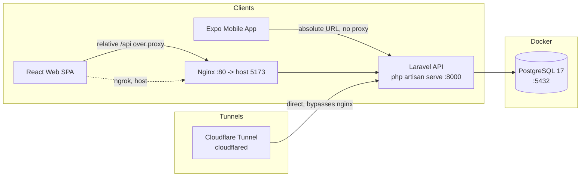

# JALIKUD

A full-stack, mobile-first financial platform built to **sustain economical and financial growth** by helping people and businesses structure, track, and grow their money. JALIKUD is a monorepo containing a Laravel REST API, a React web client, an Expo (React Native) mobile app, and a shared Postman collection for testing the API.

> **Status:** Core authentication and the customer mobile flow are connected to the Laravel API: catalog, addresses, server-priced cart/coupons, checkout, orders, profile, password, and logout. Staff/rider operations and Deals/Rewards remain clearly marked prototype data. The API is published through a Cloudflare Tunnel when its home server is online. See [Exposing the Stack via Tunnels](#exposing-the-stack-via-tunnels).

---

## Table of Contents

- [Tech Stack](#tech-stack)
- [Repository Layout](#repository-layout)
- [Architecture](#architecture)
- [Prerequisites](#prerequisites)
- [Running Locally](#running-locally)
  - [Option A � Docker Compose (recommended)](#option-a--docker-compose-recommended)
  - [Option B � Run outside Docker](#option-b--run-outside-docker)
- [Database Access](#database-access)
- [API Reference](#api-reference)
- [Authentication & Roles](#authentication--roles)
- [Testing with Postman](#testing-with-postman)
- [CI/CD & Deployment](#cicd--deployment)
- [Exposing the Stack via Tunnels](#exposing-the-stack-via-tunnels)
- [Environment Variables](#environment-variables)
- [Useful Commands](#useful-commands)
- [Troubleshooting](#troubleshooting)

---

## Tech Stack

| Layer     | Technology                                                                                             |
| --------- | ------------------------------------------------------------------------------------------------------ |
| Backend   | **Laravel 13** (PHP 8.4), **Laravel Sanctum 4** for token auth, rate-limited auth                |
| Database  | **PostgreSQL 17** (with SQLite support for quick local dev)                                            |
| Frontend  | **React 19**, **Vite 8**, **TypeScript**, **Tailwind CSS v4**, **React Router 7**, **Axios**           |
| Mobile    | **Expo 57** / **React Native 0.86** with **expo-router** (file-based routing)                           |
| Web serve | **Nginx** (serves the built frontend and proxies `/api` to the backend)                                 |
| Containers| **Docker / Docker Compose**                                                                            |
| Registry  | **GitHub Container Registry (GHCR)**                                                                    |
| CI/CD     | **GitHub Actions** (build & push images, optional self-hosted local deploy)                             |
| API tools | **Postman** (shared collection + environment)                                                           |

### Key versions

- PHP `8.4` (composer requires `^8.3`)
- Laravel framework `^13.17`
- Laravel Sanctum `^4.0`
- Node `22` (build image)
- React `19`
- PostgreSQL `17-alpine`

---

## Repository Layout

```text
JALIKUD/
+-- backend/            # Laravel REST API (separate Docker build)
�   +-- app/            #   controllers, middleware, models
�   +-- config/         #   Sanctum expiry, etc.
�   +-- database/       #   migrations, factories, seeders
�   +-- routes/api.php  #   all API routes live here
�   +-- Dockerfile
�   +-- docker-entrypoint.sh   # prepares .env, migrates, serves
+-- frontend/           # React + Vite + TS web SPA (separate Docker build)
�   +-- src/            #   pages, components, context, services
�   +-- Dockerfile      #   multi-stage: build -> nginx
�   +-- nginx.conf      #   SPA fallback + /api proxy to backend
+-- mobile/Jalikud/     # Expo / React Native app (not yet containerized)
+-- postman/            # API collection + "JALIKUD Local" environment
+-- .github/workflows/  # deploy.yml (build & push to GHCR, optional deploy)
+-- deploy.ps1          # pull GHCR images + restart local stack
+-- docker-compose.yml  # postgres + backend + frontend
+-- .env.example        # template for the root .env
+-- README.md
```

---

## Architecture

The system is a classic **client ? API ? database** split. The web SPA and the mobile app both talk to the same Laravel JSON API. In Docker, the frontend is served by **Nginx**, which also reverses proxies all `/api/*` traffic to the Laravel container so the browser only ever talks to one origin. The mobile app has no proxy in front of it and therefore must call the API by absolute URL.


```mermaid
graph LR
    subgraph Clients
        FE[React Web SPA] -->|relative /api over proxy| NG
        M[Expo Mobile App] -->|absolute URL, no proxy| API
    end

    subgraph Tunnels
        CF[Cloudflare Tunnel<br/>cloudflared]
    end

    subgraph Docker
        NG[Nginx :80 -> host 5173] --> API
        CF -->|direct, bypasses nginx| API
        API[Laravel API<br/>php artisan serve :8000] --> DB[(PostgreSQL 17<br/>:5432)]
    end

    FE -.->|ngrok, host| NG
```

Note that the Cloudflare Tunnel dials the backend **directly**, so it never traverses nginx. That is why `TRUSTED_PROXIES` has to cover both hops separately - see [Exposing the Stack via Tunnels](#exposing-the-stack-via-tunnels).

### Request flow (web)

1. The browser loads the **React SPA** from Nginx on `http://localhost:5173`.
2. The SPA (via Axios) issues requests under the `/api` base path � e.g. `POST /api/login`.
3. Nginx forwards (`proxy_pass`) `/api` to the `backend` container on port `8000`.
4. **Laravel** runs the request through middleware: rate limiting (`throttle`), optional Sanctum token guard, and the admin-only `EnsureAdmin` middleware for `/api/admin/*`.
5. Laravel reads/writes **PostgreSQL**, then returns JSON. Nginx relays the JSON back to the browser.

> When you run the frontend **without Docker** (`npm run dev`), Vite's dev server proxies `/api` ? `http://localhost:8000` (see `frontend/vite.config.ts`) � same flow, still one origin.

### Security features built in

- **Sanctum tokens** � `POST /login` / `POST /register` return a `plainTextToken`. Send it as `Authorization: Bearer <token>`.
- **Token expiry** � Sanctum tokens expire after **7 days** by default (`SANCTUM_TOKEN_EXPIRATION`, see `config/sanctum.php`).
- **Role guard** � `/api/admin/*` returns `403` unless the authenticated user has `role = admin`.
- **Self-protection** � an admin cannot demote or delete their own account.
- **Proxy trust** � `TRUSTED_PROXIES` lists only the known reverse proxies. An untrusted peer's `X-Forwarded-For` is ignored, so a client cannot spoof its IP to mint a fresh rate-limit bucket.

### Rate limiting

Every `api/*` route carries the `api` limiter, plus stricter named limiters on abuse-prone endpoints.

| Limiter | Limit | Keyed by | Applies to |
| ------- | ----- | -------- | ---------- |
| `api` (global) | 60/min anonymous, 120/min authenticated | client IP / user ID | every `api/*` route |
| `throttle:5,1` | 5/min | client IP | `POST /register`, `POST /login` |
| `orders` | 10/min | user ID (or IP) | `POST /orders` |
| `coupons` | 6/min | user ID (or IP) | `POST /cart/coupon` |
| `password` | 5/min | user ID | `PUT /password` |

> These buckets are keyed on `$request->ip()`, which is why `TRUSTED_PROXIES` must list every proxy hop. A missing entry does not disable rate limiting - it collapses *everyone* behind that hop into one bucket, so a single client can lock out all other users with `429`s.

---

## Prerequisites

| Tool              | Why                                              | Version                        |
| ----------------- | ------------------------------------------------ | ------------------------------ |
| **Docker**        | Run the whole stack with Compose                 | Docker **24+** / Compose v2 |
| **Git**           | Clone the repository                            | any recent                     |
| PHP `8.4+`        | Optional � local backend dev / laravel commands | ^8.3                           |
| Composer `2`      | Optional � backend dependencies                 | 2.x                            |
| Node.js `22+`     | Optional � frontend / mobile local dev          | 22+/20+                        |

You can run everything with **Docker alone** � PHP, Composer, and Node are only needed for the "run outside Docker" workflow or for artisan commands.

---

## Running Locally

### Option A � Docker Compose (recommended)

This spins up **four** services defined in `docker-compose.yml`:

| Service     | Container name        | Exposed port | Purpose                                                     |
| ----------- | --------------------- | ------------ | ----------------------------------------------------------- |
| `postgres`  | `jalikud-postgres`    | `5432`       | Application database (volume `pgdata`, health-checked)      |
| `backend`   | `jalikud-api`         | `8000`       | Laravel API (auto-migrates on boot)                         |
| `frontend`  | `jalikud-web`         | `5173`       | Nginx serving the React SPA and proxying `/api`             |
| `cloudflared` | `jalikud-cloudflared` | *none*     | Cloudflare Tunnel connector; publishes the API. **Requires `CLOUDFLARE_TUNNEL_TOKEN`** |

The tunnel container exposes no host port - it dials out to Cloudflare and reaches the backend over the internal `jalikud` network. Leave it out of a plain start if you are not using a tunnel:

```bash
docker compose up --build -d                       # includes cloudflared (needs the token)
docker compose up --build -d postgres backend frontend   # local-only, no token needed
```

#### 1. Configure the environment

The compose file is driven by a **root `.env`** (not the one inside `backend/`). Copy the template and fill it in:

```bash
# from the repository root
cp .env.example .env
```

The three required variables are `POSTGRES_PASSWORD`, `APP_KEY` and - when the tunnel is started - `CLOUDFLARE_TUNNEL_TOKEN`. Set them for real:

```bash
# .env
POSTGRES_DB=jalikud
POSTGRES_USER=jalikud
POSTGRES_PASSWORD=supersecret
APP_KEY=base64:PASTE-A-GENERATED-KEY-HERE
CLOUDFLARE_TUNNEL_TOKEN=eyJhIjoi...   # only if you run cloudflared
```

Generate a valid `APP_KEY` (must start with `base64:`):

```bash
# on a machine with PHP
php -r "echo 'base64:'.base64_encode(random_bytes(32));"
```

> If `POSTGRES_PASSWORD` or `APP_KEY` is missing, `docker compose up` will abort with `Set ... in the root .env`. The same applies to `CLOUDFLARE_TUNNEL_TOKEN` when the `cloudflared` service is included - either provide it or omit that service from the `up` command.

#### 2. Build & start

```bash
docker compose up --build -d
```

- `--build` compiles the images from the local `backend/` and `frontend/` Dockerfiles (not needed if you only pull pre-built images).
- `-d` runs containers detached.

#### 3. Verify

```bash
docker compose ps
```

You should see every container `Up`. Only `postgres` has a healthcheck and reports `(healthy)`; the others have no healthcheck defined, so `Up` alone is the signal.

#### 4. Open the app

- **Web app:** <http://localhost:5173>
- **API directly:** <http://localhost:8000/api/...> (e.g. `http://localhost:8000/api` health/up at `http://localhost:8000/up`)
- **Postgres:** `localhost:5432` with the credentials from `.env`

On first boot the backend container runs migrations automatically (see `docker-entrypoint.sh`), so the schema is ready � you can register a user right away.

#### Stop / reset

```bash
docker compose down          # stop (keep the database volume)
docker compose down -v       # stop AND delete the database volume (fresh start)
```

---

### Option B � Run outside Docker

Run each service directly on your machine. You still need the `backend/.env` (the Laravel one), with a database connection pointing at a running PostgreSQL (or switch to SQLite for a lightweight setup).

#### 0. Database

Either run PostgreSQL yourself, or use only the Postgres container:

```bash
docker compose up -d postgres
```

#### 1. Backend (Laravel API)

```bash
cd backend
cp .env.example .env        # set DB_*, APP_KEY, generate key
composer install
php artisan key:generate
php artisan migrate --seed  # optional --seed creates a test@example.com user
php artisan serve            # --- http://localhost:8000
```

For the web UI to proxy correctly in dev, make sure `backend/.env` has:
`(DB_* must point at your DB)`. Generate the key if `APP_KEY` is empty (`php artisan key:generate`).

#### 2. Frontend (React SPA)

```bash
cd frontend
npm install
npm run dev                  # --- http://localhost:5173, proxies /api -> :8000
```

#### 3. Mobile (Expo)

```bash
cd mobile
npm install
npx expo start               # scan the QR with Expo Go, or press a / i
```

---

## Database Access

PostgreSQL runs on `localhost:5432` with:

- **Database:** `POSTGRES_DB` (default `jalikud`)
- **User:** `POSTGRES_USER` (default `jalikud`)
- **Password:** `POSTGRES_PASSWORD` (from your root `.env`)

Connect with any client:

```bash
docker exec -it jalikud-postgres psql -U jalikud -d jalikud
# or with a GUI using host=localhost port=5432 and the values above
```

The database schema is managed by **Laravel migrations**:

| Migration | What it creates |
| --------- | --------------- |
| `create_users_table` | `users` — accounts and roles (`customer`/`staff`/`admin`/`rider`) |
| `create_addresses_table` | `addresses` — saved delivery addresses |
| `create_rider_profiles_table` | `rider_profiles` — vehicle/photo details per rider |
| `create_categories_table` | `categories` — menu sections (self-referencing hierarchy) |
| `create_menu_items_table` | `menu_items` — products with prices and availability |
| `create_variant_groups_table`, `create_variant_options_table` | `variant_groups` / `variant_options` — Size, Add-ons, etc. |
| `create_coupons_table` | `coupons` — discount codes and limits |
| `create_carts_table`, `create_cart_items_table`, `create_cart_item_options_table` | `carts`, `cart_items`, `cart_item_options` |
| `create_orders_table`, `create_order_items_table`, `create_order_item_options_table`, `create_order_status_history_table` | `orders`, `order_items`, `order_item_options`, `order_status_history` |
| `create_coupon_redemptions_table` | `coupon_redemptions` — proof of coupon use per order |
| `create_payments_table` | `payments` — payment attempts and gateway responses |
| `create_reviews_table` | `reviews` — ratings/comments (1–5) |
| `create_store_settings_table` | `store_settings` — single-row store configuration |
| `create_personal_access_tokens_table` | Sanctum API token storage |
| `create_framework_tables` | Laravel cache / queue / session tables |

### Database reference

The authoritative schema description is the migration set itself in `backend/database/migrations`, plus the live models:

```bash
cd backend
php artisan migrate:status     # applied / pending migrations
php artisan db:show            # tables, sizes, indexes
```

- **[`backend/README.md`](backend/README.md)** - API route table, auth flow, and worked request examples.
- **[`frontend/docs/API_WIRING.md`](frontend/docs/API_WIRING.md)** - the data contract between the Laravel serialisers and the clients, including which fields must stay in sync.

> The standalone design documents (`DATA_DICTIONARY.md`, `DATA_MODEL.md`, `DATA_MODEL.drawio`, `DATABASE_SCHEMA.md`) were removed in commit `14dd219` and no longer exist. The migration table above is the source of truth - regenerate it with `php artisan migrate:status` rather than looking for an external document.

---

## API Reference

All endpoints live under the `/api` prefix (an API prefix middleware is applied automatically by Laravel, and Nginx/Vite proxy this path to the backend). The backend responds with JSON (configured via `shouldRenderJsonWhen(...)` in `bootstrap/app.php`).

### Response conventions

- **Always JSON, never a redirect.** An unauthenticated call to a protected `api/*` route returns `401` with `{"message":"Unauthenticated."}` regardless of the `Accept` header. This app is API-only and defines no `login` route, so Laravel's default guest redirect target (`route('login')`) is overridden in `bootstrap/app.php` - without that, a `curl` or browser request with no `Accept: application/json` would throw and surface as a misleading `500`.
- **Validation errors return `422`** with a top-level `message` plus a per-field `errors` object.
- **Bad credentials return `422`**, not `401`, so clients can treat it like any other validation failure.
- **CORS** is configured in `backend/config/cors.php` (`paths: api/*`, wildcard origins, `supports_credentials: false`). Wildcard origins are safe here because auth is a bearer token rather than a cookie; if you ever move to Sanctum's cookie-based stateful domains you must lock `allowed_origins` down **and** enable `supports_credentials`.

### Public endpoints

| Method | Path          | Description                                 | Rate limit |
| ------ | ------------- | ------------------------------------------- | ---------- |
| `POST` | `/api/register` | Create an account, returns user + token   | 5/min |
| `POST` | `/api/login`    | Authenticate, returns user + token        | 5/min |

**Register request body:**
```json
{ "name": "Jane Doe", "email": "jane@example.com", "password": "password123", "password_confirmation": "password123" }
```

**Login request body:**
```json
{ "email": "jane@example.com", "password": "password123" }
```

Both return:
```json
{ "message": "...", "user": { "id": 1, "name": "...", "email": "...", "role": "user", ... }, "token": "1|xxxxxxxxxx" }
```

> ?? Auth is limited to **5 requests per minute per IP**. If you hit `429 Too Many Requests`, wait a minute.

### Protected endpoints (require `Authorization: Bearer <token>`)

| Method   | Path                | Description                                                       |
| -------- | ------------------- | ----------------------------------------------------------------- |
| `GET`    | `/api/user`         | Return the authenticated user                                    |
| `PUT`    | `/api/profile`      | Update own name / email                                           |
| `PUT`    | `/api/password`     | Change own password (needs `current_password`)                    |
| `POST`   | `/api/logout`       | Revoke the current token                                          |

**Update profile body:** `{ "name": "...", "email": "..." }`
**Change password body:** `{ "current_password": "...", "password": "...", "password_confirmation": "..." }`

> **Role cannot be set here.** `role` is not mass-assignable on the `User` model, so
> `POST /api/register` silently ignores a `role` key and always creates a **customer**.
> Staff, rider, and admin accounts are created through `POST /api/admin/users`.
> See [RoleEscalationTest.php](backend/tests/Feature/RoleEscalationTest.php).

#### Addresses

A customer's own delivery addresses. These routes are **required for delivery checkout**:
`POST /api/orders` demands an `address_id` owned by the caller whenever `order_type` is
`delivery`, so without them a customer who registered through the public API could only
ever check out for **pickup**.

| Method         | Path                       | Description                                |
| -------------- | -------------------------- | ------------------------------------------ |
| `GET`          | `/api/addresses`           | List own addresses (default first)         |
| `POST`         | `/api/addresses`           | Create an address                          |
| `PUT` / `PATCH` | `/api/addresses/{address}` | Update own address (PATCH-like, partial)   |
| `DELETE`       | `/api/addresses/{address}` | Delete own address                         |

**Create body:** `{ "label": "Home", "line1": "...", "line2": "...", "city": "...", "state": "...", "postal_code": "...", "country": "Philippines", "latitude": 14.6254, "longitude": 121.043, "is_default": false }`

Only `line1` and `city` are required (and only on create). A few behaviours worth knowing:

- The **first** address becomes the default automatically, so a checkout UI always has
  something to pre-select.
- Promoting an address **demotes** the previous default - a user never has two.
- Deleting the default **promotes** the most recent survivor, so an account is never left
  with no default.
- `user_id` is never read from the request; ownership always comes from the token.
- Addresses are private: another user's address id returns `422` and is left untouched.


### Admin endpoints (require a user with `role = admin`)

| Method  | Path                 | Description                              |
| ------- | -------------------- | ---------------------------------------- |
| `GET`    | `/api/admin/users`   | Paginated list; `?page=` `&per_page=` (max 100) `&search=` |
| `POST`   | `/api/admin/users`   | Create a user with an explicit `role`     |
| `GET`    | `/api/admin/users/{id}` | Show one user                         |
| `PUT/PATCH` | `/api/admin/users/{id}` | Update name/email/password/role     |
| `DELETE` | `/api/admin/users/{id}` | Delete a user                        |

**Create user body:** `{ "name": "...", "email": "...", "password": "password123", "role": "user" }` (role: `user` or `admin`)

Non-admins calling `/api/admin/*` receive:

```json
{ "message": "Forbidden. Administrator access required." }
```

> A list of users returns `data` (array) plus `meta` (current_page, last_page, per_page, total).

---

## Authentication & Roles

- New users are created with `role = 'user'` by default (the `role` column is an enum `user`/`admin`).
- Tokens are issued via **Laravel Sanctum** and expired after **7 days** by default.
- `/api/admin/*` is protected by the `EnsureAdmin` middleware (`app/Http/Middleware/EnsureAdmin.php`).

### Making yourself an admin (to test the admin API)

Registration always yields a `user` role, so to exercise the admin endpoints you need an admin account. With an already-running stack:

```bash
# A) via psql
docker exec -it jalikud-postgres psql -U jalikud -d jalikud \
  -c "UPDATE users SET role='admin' WHERE email='your@email.com';"

# or B) via artisan tinker (run from backend/ locally, or docker exec into jalikud-api)
cd backend && php artisan tinker
> App\Models\User::where('email','your@email.com')->update(['role'=>'admin']);
```

After that, the user can log in and call `/api/admin/*`.

---

## Testing with Postman

The repo ships a ready-to-use Postman collection and environment in the `postman/` folder:

- `postman/JALIKUD_API.postman_collection.json`
- `postman/JALIKUD_Local.postman_environment.json`
- `postman/JALIKUD_Production.readonly.postman_environment.json` — points at the live tunnel **for read-only checks only** (`GET` catalog/orders). Never run write folders with it selected.

> **Do NOT run the `Admin Catalog & Coupons` folder (Create/Update Category, Menu Item, Coupon) against production (`https://api.cahuco.me/api`).** Those requests auto-generate `Postman Cat t-*` / `Postman Meal t-*` rows that pollute the live menu the mobile app displays. Run writes only against `JALIKUD Local` (`http://localhost:5173/api`). If production is ever polluted, restore the real menu with:
>
> ```powershell
> docker exec -it jalikud-api php artisan db:seed --class=MenuSeeder --force
> ```
>
> or `cd backend && composer reseed-menu`. `MenuSeeder` force-deletes the `Postman % / t-* / SKU-t-*` rows (clearing junk cart lines first), then re-seeds the 4 real categories / 10 real items. Verify with `GET /api/categories?active=true` (4 rows) and `GET /api/menu?available=true` (10 rows).

### 1. Import

Open **Postman ? Import ? Files**, select both files (or drag them in), and import.

### 2. Select the environment

In the top-right environment dropdown choose **`JALIKUD Local`**. This environment pre-fills `base_url`:

```text
http://localhost:5173/api
```

| Variable        | Value                    | Purpose                              |
| --------------- | ------------------------ | ------------------------------------ |
| `base_url`      | `http://localhost:5173/api` | Base for every request             |
| `token`         | *(auto-filled)*          | Bearer token, set by Login/Register  |
| `user_id`       | `1`                      | Used in admin `{id}` routes          |
| `page`          | `1`                      | Admin pagination param               |
| `admin_search`  | *(blank)*                | Admin `search` query param           |

### 3. Run the flow

1. **Make sure the stack is running** (`docker compose up --build -d` → app on `http://localhost:5173`).
2. Run the folders **top-to-bottom** so the flow-state variables are ready before they are used.
3. Two different tokens are used because **admin endpoints require an admin account** (see [Authentication & Roles](#authentication--roles)):
   - `token` = the **normal user** token, set by **Auth → Register / Login (normal user)** and used by **My Account**.
   - `admin_token` = the **admin** token, set by **Admin → Login (as Admin)** and used by **every** `/api/admin/*` request.

> **Before testing the Admin folder, set `admin_username` and `admin_password` in the `JALIKUD Local` environment to an existing user whose role is `admin`.** Registration always creates a `user`; if you have no admin yet, promote one via psql/`tinker` (see [Authentication & Roles](#authentication--roles)).

### Recommended run order

1. **Auth → Register** (or **Login (normal user)**) → sets `token`.
2. **My Account** (Get Me, Update Profile, Change Password) → uses `token`.
3. **Admin → Login (as Admin)** → sets `admin_token`.
4. **Admin** CRUD (List, Search, Create, Show, Update, Delete) → uses `admin_token`.
5. **Test Data → View Generated Test Inputs** → inspect current inputs/tokens.
6. **Teardown** → **Logout (normal user)** and **Logout (admin)** revoke both tokens (run last).

> **Test Data → View Generated Test Inputs** prints the exact inputs and both tokens (`token`, `admin_token`) to the Postman console.

### Why admin requests return `403` (and how I fixed it)

`/api/admin/*` is gated by the `EnsureAdmin` middleware: it returns `403 Forbidden. Administrator access required.` unless the token's user has `role = 'admin'`. `Register`/`Login` always create **non-admin** users, so using the normal `token` on admin calls correctly fails. The collection now has an explicit **Admin → Login (as Admin)** step that uses `admin_username`/`admin_password` and stores a **dedicated `admin_token`** that all admin requests actually use.

### Dynamic, repeatable inputs (no DB cleanup needed)

To avoid `unique`-column (email) errors on re-runs, every **write** request auto-generates its inputs via a **pre-request script** that produces fresh, unique values each run. You can run the whole collection over and over without deleting rows.

| Folder | Variables (auto-generated, `input_*` / `admin_*`) | Used by |
| ------ | ------------------------------------------------ | ------- |
| Auth / My Account | `input_name`, `input_email`, `input_password`, `input_new_password` | Register, Login (normal user), Update Profile, Change Password |
| Admin (create) | `admin_input_name`, `admin_input_email`, `admin_input_password`, `admin_input_role` | Create User |
| Admin (update) | `admin_update_name`, `admin_update_email` | Update User |
| Admin (auth) | `admin_username`, `admin_password` *(you set these)* | Login (as Admin) |

- **Any variable prefixed `input_` or `admin_` is a Postman-provided TEST INPUT.** `input_*` and `admin_input_*`/`admin_update_*` change every run so unique fields (email) never collide; `admin_username`/`admin_password` are the one input you must supply (the admin account).
- **Flow variables** set from responses: `token`, `admin_token`, and `user_id` (from Create User, reused by Show/Update/Delete — you never edit them by hand).
- Want static values instead? Edit the value in the `JALIKUD Local` environment — but note the pre-request script will overwrite it on the next run. To pin a value, delete the generator lines in that request's **Pre-request Script**.

### Troubleshooting in Postman

- **`401`, empty `token`** — run **Auth → Register/Login** first so `token` is filled (and don't run **Logout (normal user)** before the other user calls).
- **`403` on Admin routes** → the `admin_token` belongs to a non-admin, or `admin_username`/`admin_password` are wrong/empty. Re-run **Admin → Login (as Admin)** after setting correct admin credentials.
- **`403` right after admin login** → verify the account's `role` is `admin` (promote it — see [Authentication & Roles](#authentication--roles)).
- **`404` on Admin `{id}`** → re-run **Admin → Create User** (it sets `user_id` to the id it just created).
- **`429`** → hit the 5/minute auth rate limit; wait and retry.
- **Connection errors** → confirm the Docker stack is up and `base_url` is `http://localhost:5173/api`.

## CI/CD & Deployment

Deployment is container-based and driven by `.github/workflows/deploy.yml`. It is **manual** (`workflow_dispatch`) so you control when releases happen.

### What the workflow does

1. Checks out the repo and logs into **GHCR** (`ghcr.io`).
2. Builds and pushes both images with `latest` + `${{ github.sha }}` tags:
   - `ghcr.io/jiwonieee19/jalikud-api`
   - `ghcr.io/jiwonieee19/jalikud-web`
3. If a **self-hosted runner** (`runs-on: [self-hosted]`) is registered in repo **Settings ? Actions ? Runners** with Docker installed, it pulls the images and restarts the local Compose stack automatically.

### Updating a local machine from pre-built images

For the "deploy onto the host machine" flow, `deploy.ps1` logs into GHCR, pulls the `latest` backend/frontend images, and restarts the containers:

```powershell
# from the repo root
.\deploy.ps1 -Token <github_pat_with_read:packages>
# or run it with no args to be prompted securely for the token
```

> Create a classic **Personal Access Token** on GitHub at **Settings ? Developer settings ? Personal access tokens** with the `read:packages` scope.

---

## Exposing the Stack via Tunnels

The stack can be published to the internet using **two different tunnels on purpose**:

| What | Tunnel | Where it runs | Reaches |
| ---- | ------ | ------------- | ------- |
| **Laravel API** | Cloudflare Tunnel (`cloudflared`) | **Inside Docker** as the `cloudflared` service | `backend:8000` directly |
| **React web app** | ngrok | **Outside Docker**, on the host | `localhost:5173` (nginx) |

The reason for the split is that each tunnel only needs to front the service it actually serves. `cloudflared` dials the backend directly and never touches nginx; ngrok publishes the already-published frontend port, and nginx keeps proxying `/api` to the backend over the internal network. Because the SPA uses a relative Axios `baseURL` (`/api`, see `frontend/src/services/api.ts`), the browser keeps talking to a single origin and needs no CORS changes.

```text
internet --+-- ngrok (host)  --> localhost:5173 -> frontend:80 --+--> SPA
           |                                                   +--> /api --+
           +-- cloudflared --> backend:8000 -------------------------------+
```

### 1. Cloudflare Tunnel (the API, in Docker)

**Step 1 - Create the tunnel.** Zero Trust -> **Networks** -> **Tunnels** (older UI: *Connectivity* -> *Tunnels*) -> **Create a tunnel** -> **Cloudflared** -> name it `jalikud-api` -> **Next**.

**Step 2 - Grab the token (ignore the printed command).** Choose the **Docker** tab and copy the token out of the command Cloudflare shows:

```bash
docker run cloudflare/cloudtunnel:latest tunnel --no-autoupdate run --token eyJhIjoi...
```

Do **not** run that command. The `cloudflared` service in `docker-compose.yml` already runs the connector; the only thing needed from this page is the token. Put it in the root `.env`:

```bash
CLOUDFLARE_TUNNEL_TOKEN=eyJhIjoi...
```

The connector then reports **Healthy** on the Tunnels list.

**Step 3 - Add the published application route.** **Routes** tab (older UI: **Public Hostname**) -> **Add route** -> **Published application**:

| Field | Value |
| ----- | ----- |
| Subdomain | `api` |
| Domain | your domain |
| Path | *(leave blank)* |
| **Service URL** | **`http://backend:8000`** |

> **The Service URL must be `http://backend:8000`, not `http://localhost:8000`.**
> The dashboard suggests `localhost`, and that is the most common mistake here. `cloudflared`
> runs *inside* the compose network, so `localhost` points at the cloudflared container itself:
> the tunnel connects successfully and then returns `502` on every request. `backend` is
> resolved through Docker's internal DNS.

> **Leave Path blank.** Scoping the route to `/api` does not strip the prefix - Cloudflare
> matches on the prefix but forwards the original path, so Laravel would receive
> `/api/api/...`. Point the route at the service root and let paths pass through.

> **Prerequisites.** The route needs a hostname Cloudflare manages as a nameserver zone, or
> the Domain dropdown will not offer it. A multi-level subdomain (`api.dev.example.com`)
> additionally requires an Advanced Certificate ordered for that hostname.

**Step 4 - Start it and verify.**

```bash
docker compose up -d cloudflared
docker compose logs -f cloudflared      # look for "Registered tunnel connection" (x4)
curl https://api.yourdomain.com/api/menu?per_page=1
```

Then set the public origin so Laravel generates absolute URLs against the tunnel rather than
localhost:

```bash
# root .env
APP_URL=https://api.yourdomain.com
```

```bash
docker compose up -d backend
```

> Requires a domain on your Cloudflare account. The free `trycloudflare.com` quick tunnels
> cannot be pinned via token and get a new hostname on every restart.

### 2. ngrok (the web app, outside Docker)

```bash
ngrok config add-authtoken <your token>   # once
ngrok http 5173
```

This forwards to the frontend container's published port, so the SPA and its `/api` calls are served from one ngrok URL. On the free tier the URL changes each session and browsers show an interstitial notice on first visit.

### 3. Trusted proxies (`TRUSTED_PROXIES`)

**This is the setting to watch when adding or changing tunnels.** Rate-limit buckets are keyed on `$request->ip()`, so any hop in front of Laravel that is not listed makes every client behind it share **one** bucket, and a single caller can then `429` everyone else.

Three hops can terminate in front of the API, so all three must be trusted:

| Entry | Hop |
| ----- | --- |
| `172.30.0.1` | Docker bridge gateway - reached only because ngrok runs on the host and hits the published port. Docker's port publishing makes nginx see the gateway as `$remote_addr`, and nginx appends it to `X-Forwarded-For`. |
| `172.30.0.20` | The nginx (`frontend`) container that proxies `/api`. |
| `172.30.0.30` | The `cloudflared` container, which bypasses nginx entirely. |

Laravel walks `X-Forwarded-For` right-to-left and stops at the first address it does **not** trust. Trust a specific address, never the whole `172.30.0.0/24` subnet - trusting the subnet re-trusts the clients themselves and collapses the buckets again.

If you change `CLOUDFLARE_IP` (or `BACKEND_IP` / `FRONTEND_IP`), update `TRUSTED_PROXIES` to match. Regression coverage for all three hops lives in `backend/tests/Feature/TrustedProxyTest.php`.

### 4. Production mode

The Compose defaults are `APP_ENV=production` and `APP_DEBUG=false`, because a tunnel makes the API reachable from the internet and debug mode would leak stack traces and `.env` values. For local debugging set `APP_ENV=local` and `APP_DEBUG=true` in the root `.env`. Set `APP_URL` to the tunnel hostname so Laravel generates URLs against the right origin.

### 5. Securing the exposed API

Anyone can reach the API hostname once the tunnel is up. `POST /api/register` and `POST /api/login` are publicly reachable (throttled to 5/min), and `/api/admin/*` is protected only by a bearer token plus the `EnsureAdmin` middleware. Add a **Cloudflare Access** policy on the tunnel to require authentication in front of the API.

---

## Environment Variables

### Root `.env` (used by Docker Compose)

| Variable          | Required | Default   | Notes                                              |
| ----------------- | -------- | --------- | -------------------------------------------------- |
| `POSTGRES_DB`     | no       | `jalikud` | Database name                                      |
| `POSTGRES_USER`   | no       | `jalikud` | Database user                                      |
| `POSTGRES_PASSWORD` | **yes** | �         | Database password (**Compose aborts if empty**)     |
| `APP_KEY`         | **yes**  | �         | Laravel app key, must be `base64:`-prefixed (**Compose aborts if empty**) |
| `GHCR_TOKEN`      | no       | �         | Used by the deploy workflow for `docker login`      |
| `CLOUDFLARE_TUNNEL_TOKEN` | with the tunnel | � | Cloudflare tunnel token (**Compose aborts if `cloudflared` is started and this is empty**) |
| `CLOUDFLARE_IP`   | no       | `172.30.0.30` | Pinned IP of the `cloudflared` container. **Must be listed in `TRUSTED_PROXIES`**, or every remote API caller shares one rate-limit bucket |
| `TRUSTED_PROXIES` | no       | `172.30.0.1,172.30.0.20,$CLOUDFLARE_IP` | Proxies trusted for `X-Forwarded-*`. Keep in sync with the pinned container IPs |
| `APP_URL`         | no       | `http://localhost:8000` | Set to the tunnel hostname so Laravel generates absolute URLs against it |
| `APP_ENV` / `APP_DEBUG` | no | `production` / `false` | Use `local` / `true` only for local debugging |

### Laravel `backend/.env` (used for non-Docker runs)

Standard Laravel variables, notably:

| Variable | Default | Notes |
| -------- | ------- | ----- |
| `DB_CONNECTION` | `pgsql` | `sqlite` also works for quick local dev |
| `DB_HOST` / `DB_PORT` | `127.0.0.1` / `5432` | `postgres` when running inside Compose |
| `DB_DATABASE` / `DB_USERNAME` / `DB_PASSWORD` | `jalikud` / `jalikud` / `secret` | match your DB |
| `SANCTUM_TOKEN_EXPIRATION` | `10080` (7 days) | token lifetime in minutes; `null` = no expiry |
| `APP_KEY` | � | generate with `php artisan key:generate` |

> `.env` files are git-ignored � never commit real secrets.

---

## Useful Commands

| Task | Command |
| ---- | ------- |
| Start full stack (build) | `docker compose up --build -d` |
| View logs (follow) | `docker compose logs -f` |
| Logs for one service | `docker compose logs backend` (or `frontend`, `postgres`) |
| Stop stack (keep data) | `docker compose down` |
| Reset everything | `docker compose down -v` |
| Backend tests | `cd backend && vendor/bin/phpunit` |
| Run one test class | `cd backend && vendor/bin/phpunit --filter=TrustedProxyTest` |
| Start / restart the tunnel | `docker compose up -d --force-recreate cloudflared` |
| Backend formatter | `cd backend && vendor/bin/pint` |
| Frontend lint | `cd frontend && npm run lint` |
| Frontend typecheck+build | `cd frontend && npm run build` |
| List migrations status | `cd backend && php artisan migrate:status` |
| Create a migration | `cd backend && php artisan make:migration create_x_table` |
| Interactive tinker | `cd backend && php artisan tinker` |

---

## Troubleshooting

| Problem | Fix |
| ------- | --- |
| `Compose up` fails with "Set POSTGRES_PASSWORD ..." | Fill `POSTGRES_PASSWORD` in root `.env` |
| `Compose up` fails with "Set APP_KEY ..." | Set a `base64:`-prefixed `APP_KEY` in root `.env` (see [Running Locally](#option-a--docker-compose-recommended)) |
| Backend logs show DB "Connection refused" | The API starts before Postgres is ready even with `depends_on`; check `docker compose logs backend` and restart once Postgres is healthy |
| Frontend loads, API returns 502 | Backend not reachable; `docker compose logs backend` |
| `429 Too Many Requests` on auth | Rate limiter (5/min). Wait a moment and retry |
| `Compose up` fails with "Set CLOUDFLARE_TUNNEL_TOKEN ..." | Fill `CLOUDFLARE_TUNNEL_TOKEN` in the root `.env`, or drop `cloudflared` from the `up` command |
| Tunnel hostname returns `502` | The route's **Service URL** is wrong. It must be `http://backend:8000` (the Compose service name), not `http://localhost:8000` - from inside the cloudflared container `localhost` is the tunnel container itself |
| Tunnel returns `/api/api/...` or `404` | The published route has a **Path** set to `/api`. Cloudflare matches the prefix but does not strip it, so Laravel receives a doubled prefix. Leave Path blank |
| Every user shares one rate-limit bucket | A proxy hop is missing from `TRUSTED_PROXIES`. All three (`172.30.0.1` gateway, `172.30.0.20` nginx, cloudflared's IP) must be listed, and `CLOUDFLARE_IP` must match the value in `TRUSTED_PROXIES` |
| `403` on `/api/admin/*` | Account role is not `admin` � promote via psql/tinker (see [Authentication & Roles](#authentication--roles)) |
| Port `8000`/`5173`/`5432` in use | Change the `ports:` mapping in `docker-compose.yml`, then re-run `docker compose up -d` |

---

## Roadmap / What's Next

- [x] Add feature tests for auth + admin, and trusted-proxy regression coverage
- [x] Address CRUD so **delivery** checkout is reachable for public-API customers
- [x] Remove `role` from `User::$fillable` (was only safe by accident)
- [ ] Put a **Cloudflare Access** policy in front of the public API hostname
- [ ] Rider assignment (`PUT /api/admin/orders/{order}/rider`) + `GET /api/admin/riders`
- [ ] Staff / rider role capabilities (queues) - `isRider()` and `isStaff()` are still unused
- [ ] Variant-group admin CRUD, reviews, and payments endpoints (tables exist, no routes)
- [x] Wire the Expo customer app to the live API (absolute base URL + `expo-secure-store` tokens)
- [ ] Replace the web dashboard's `frontend/src/mock/` data with real API calls
- [ ] Add automated tests to CI before pushing images
- [ ] Real financial domain models (accounts, transactions, budgets, reporting)

---

# JALIKUD Mobile

Expo (React Native) app for JALIKUD — customers use the Laravel API, while the unfinished **Staff**, **Rider**, **Deals**, and **Rewards** experiences remain labeled previews.

> Expo SDK 57 · React Native 0.86 · expo-router

## Connecting it to the API

The app uses `mobile/src/lib/api.ts` and `mobile/src/lib/customer-api.ts`. Authentication tokens are persisted with `expo-secure-store`. Configure the absolute API URL before starting Expo:

- **Use an absolute base URL.** Unlike the web SPA (which uses a relative `/api` and relies on nginx), React Native has no proxy in front of it. Point it at the tunnel hostname, e.g. `https://api.yourdomain.com/api`, driven by an `EXPO_PUBLIC_API_URL` env var so the bundle is not tied to one environment:

  ```bash
  # mobile/.env
  EXPO_PUBLIC_API_URL=https://api.cahuco.me/api
  ```

- **No ATS exception is needed** when the API is behind `https://`. Reaching a plain-`http://` host from a device would otherwise require an App Transport Security exception in `app.json` and `usesCleartextTraffic` on Android.
- **Store the token in `expo-secure-store`, not `AsyncStorage`.** The web client keeps its Sanctum token in `localStorage`, which React Native does not have; and a bearer token in plain AsyncStorage is readable by anything with filesystem access on a compromised device.
- **Any network works.** A physical device reaches the API over the internet via the tunnel, so the "same Wi-Fi" requirement below no longer applies — the tunnel just has to be connected.
- **Mind the rate limits.** `/login` and `/register` are capped at 5/min per IP, and because `TRUSTED_PROXIES` resolves your real client IP, device traffic buckets separately from your `localhost` calls.
- Expo Go uses a native fetch stack and does **not** enforce CORS, so `backend/config/cors.php` is only relevant if you later add a web view.

## 1. Get Expo Go

Expo Go is the app you use to open this project on your phone.

- **Android:** install from Google Play (search **"Expo Go"**)
- **iOS:** install from the App Store (search **"Expo Go"**)
- Or use the official page: **https://expo.dev/go**

Expo Go supports SDK 57, so this project opens in it directly.

## 2. Run the app

1. Install **Node.js 22+** (<https://nodejs.org>) and check it: `node -v`
2. In the `mobile` folder, install dependencies:

   ```bash
   npm install
   ```

3. Start the dev server:

   ```bash
   npx expo start
   ```

4. Open it on your phone:
   - **Android:** open **Expo Go** and scan the QR code in the terminal.
   - **iOS:** open the **Camera** app, scan the QR code, then tap the banner.

> Phone and computer must be on the **same Wi-Fi**. If the QR won't connect, run `npx expo start --tunnel`.

## 3. Login accounts

Use an account stored by the Laravel API. Public registration creates a real
`customer` account only. Staff, admin, and rider accounts must be provisioned by
an administrator; there are no bundled demo credentials.

## 4. Using the app

**Customer** — tabs: Menu, Deals, Rewards, Cart, Orders, Settings

- Browse the menu and add items to the cart, then review it in **Cart**.
- Check **Orders** for your order history.

**Staff preview** — tabs: Orders, Menu Status, Riders, Activity

- **Orders:** confirm, reject, or assign incoming orders to a rider.
- **Menu Status:** toggle item availability. **Riders:** view riders. **Activity:** recent actions.

**Rider preview** — tabs: Deliveries, History (plus a top-right availability switch and **Exit**)

- Toggle availability on, then open **Deliveries** to see the route/map and update a delivery.
- **History** shows past deliveries. **Exit** signs you out.

## 5. Scripts

| Command                 | What it does                                 |
| ----------------------- | -------------------------------------------- |
| `npm start`             | Start the Expo dev server                    |
| `npm run android`       | Start and open on an Android device/emulator |
| `npm run ios`           | Start and open on an iOS simulator           |
| `npm run lint`          | Run ESLint                                   |
| `npm run reset-project` | Reset to a blank starter `app/` folder       |

## 6. Troubleshooting

| Problem                                                 | Fix                                                    |
| ------------------------------------------------------- | ------------------------------------------------------ |
| QR won't connect                                        | Same Wi-Fi, or `npx expo start --tunnel`               |
| "Project is incompatible with this version of Expo Go"  | Update Expo Go from the store                          |
| Port 8081 in use                                        | Stop the other process, or press `y` for a new port    |
| Stale/odd errors                                         | Restart with `npx expo start -c` (clear cache)         |
| Native tabs / map look off                               | Use a development build (`npx expo run:android` / `run:ios`) |

## Notes

- All accounts, orders, and cart data are **in-memory only** — restarting the app resets everything.
- The app is **not yet wired to the JALIKUD API** (`src/services` is empty).

## Learn more

- Expo SDK 57 docs: <https://docs.expo.dev/versions/v57.0.0/>
- Expo Router: <https://docs.expo.dev/router/introduction>


## License

See the `mobile/License` file for the app license (and the Laravel/Expo MIT license agreements for their components).
